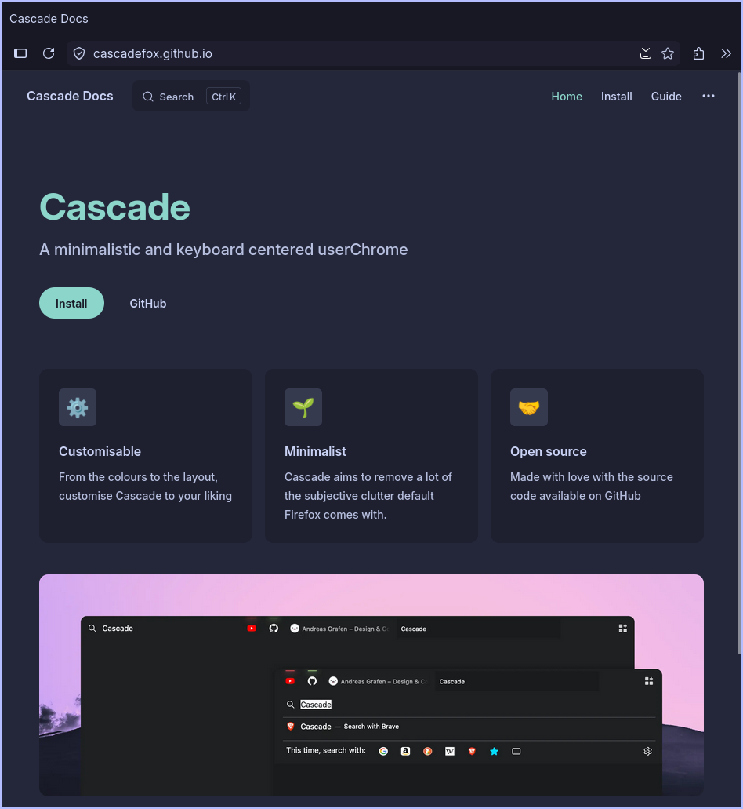
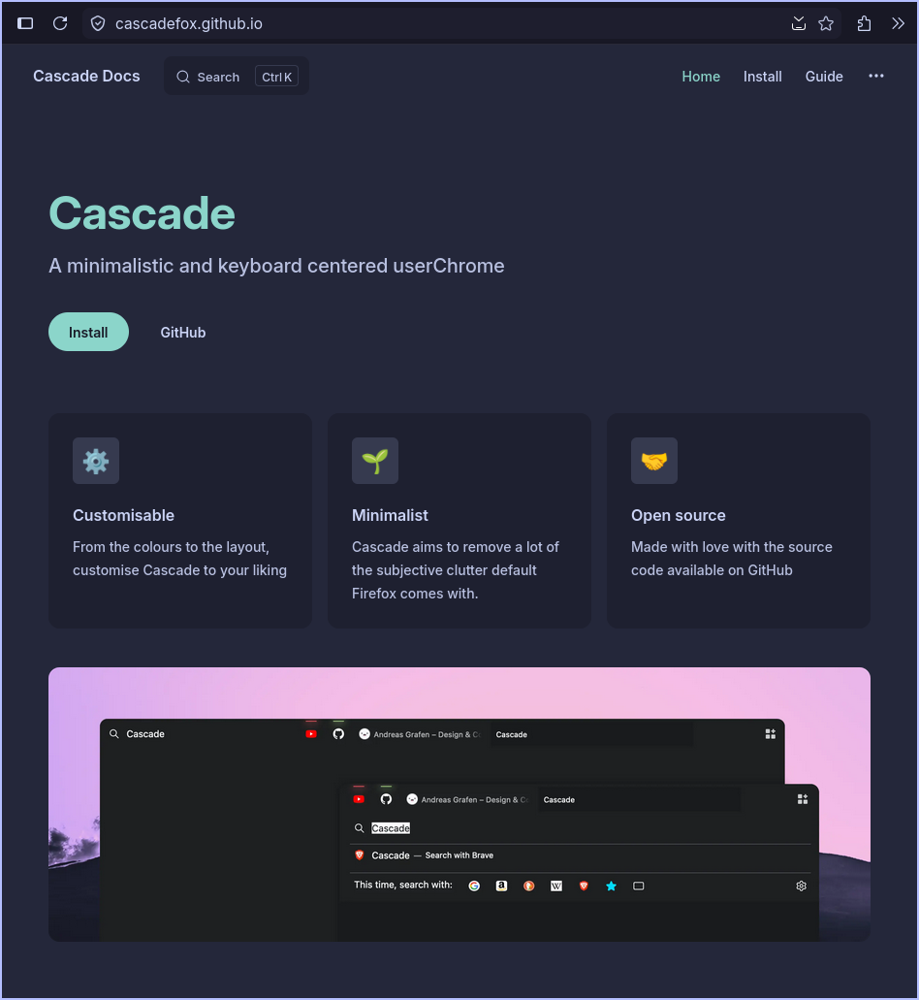

# Cascade

**A minimalistic and keyboard centered userChrome**

Cascade aims to remove a lot of the subjective clutter default Firefox comes with. The theme is also highly inspired by the stylistic choices of [SimpleFox](https://github.com/migueravila/SimpleFox) 🦊 by [Miguel Ávila](https://github.com/migueravila).

 

  
  
  
  

### My Fork
The main change is the addition of `includes/onetab-oneline.css` which enforces the 1 line bar even when the window is shrunk if we have only 1 tab in the window.

This repo is only for personal use, with changes that focuses on integration with specifically the **Catppuccin Mocha** theme.
- Added `--uc-selected-tab` color in `cascade-mocha.css` to fix the low contrast on the current tab
- Removed (commented out) style for the URL bar dropdown hovered / selected entry in `cascade-nav-bar.css`
    - Particularly the style for `.urlbarView-row:hover > .urlbarView-row-inner` and `.urlbarView-row[selected] > .urlbarView-row-inner`
    - The `--toolbar-field-focus-background-color` is used by Firefox to colour the entire dropdown box, hence the selected entry has no constrast

| Original                             | This Fork                           |
|--------------------------------------|-------------------------------------|
|  |  |

---

### Documentation

**[Installation](https://cascadefox.github.io/installation.html) • [Customisation](https://cascadefox.github.io/customisation.html) • [Integrations](https://cascadefox.github.io/integrations.html) • [Keyboard Shortcuts](https://cascadefox.github.io/shortcuts.html)**

 
